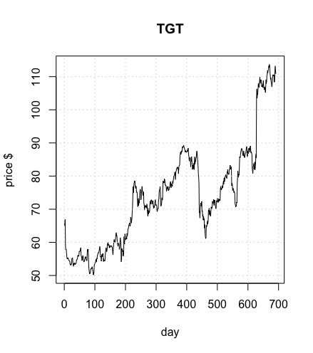

# Introduction
This is an implementation of a support vector machine designed to identify short-term stock price changes, based on previous stock parameters: open, low, high, close, volume

## Stock selected for this exercise:

<!-- put your justification/choice here: !-->


```{r setup, echo=FALSE, include=FALSE}
knitr::opts_chunk$set(echo = TRUE)
library(e1071)
```

## get data:

```{r}
tgtData = read.csv('TGT.csv')
attach(tgtData)
# set up data frame
tgtDataFrame = data.frame(open=price.open, high=price.high,
        low=price.low, close=price.adjusted,volume= volume/10000,sale=sale.price,change = direction)
head(tgtDataFrame)
tail(tgtDataFrame)
remove(tgtData)

```

```{r}
levels(direction)
plot(tgtDataFrame)
```
model_test <- svm(x, y)


## classification model, categorical response

### traditional interface:
```{r}
x <- subset(tgtDataFrame[1:231,], select = -change)
y <- tgtDataFrame[1:231,]$change

model_test<- svm(x,y) 

print(model_test)
summary(model_test)
```


## how well did the model fit?

```{r}
pred <- predict(model_test, x)

# Check accuracy:
table(pred, y)


```

## decision values

```{r}
# compute decision values and probabilities:
pred <- predict(model_test, x, decision.values = TRUE)
attr(pred, "decision.values")[1:7,]

# visualize (classes by color, SV by crosses):
plot(cmdscale(dist(tgtDataFrame[,-7])),
     col = as.integer(tgtDataFrame[,7]),xlab="normalized X", ylab = "$ change",
     pch = c("o","+")[1:200 %in% model_test$index + 1])
legend('bottomleft',c('data','prediction'),pch=c('0','+'))
grid()


     
```


# train and test set:

```{r}
pctTrain=0.66
#nObs = length(x[,1])
nObs=231
nTrain = round(pctTrain*nObs,0)
TrainSetIndex = 1:nTrain


# or ?
#scramble=sample(1:nObs)
#TrainSetIndex=scramble[1:nTrain]
#TestSetIndex= scramble[(nTrain+1):nObs]
```

## set up training set, test set

```{r}
# first the training set

XtrainSet = tgtDataFrame[TrainSetIndex,-7]
YtrainSet = tgtDataFrame$change[TrainSetIndex]
```

## get the model from training set.. 

```{r}
model_train<- svm(XtrainSet, YtrainSet) 
print(model_train)
summary(model_train)
```

## now the test set.. 

```{r}
XtestSet = tgtDataFrame[(nTrain:nObs),-7]
YtestSet = tgtDataFrame$change[nTrain:nObs]
```

## and evaluate with the test data

```{r}
pred2 <- predict(model_train, XtestSet)
# And the accuracy..

table(pred2, YtestSet)
```

## tune

```{r}
stockTuned <- tune.svm(XtrainSet, YtrainSet, gamma = 2^(-1:1), cost = 2^(-1:6))

summary(stockTuned)
plot(stockTuned)
```

```{r}
#use optimized parameters... 
model_tuned <- svm(XtrainSet, YtrainSet, gamma=0.5, cost=2) 

print(model_tuned)
summary(model_tuned)
```

```{r}
pred3 <- predict(model_tuned, XtestSet)
# And the accuracy..

table(pred3, YtestSet)

```

```{r}
pred= predict(model_tuned,XtestSet,decision.values = TRUE)
attr(pred,"decision.values")[1:20,]
```

```{r}
plot(cmdscale(dist(XtestSet)),
     col = as.integer(YtestSet),xlab="normalized X", ylab = "$ change",
     pch = c("o","+")[1:200 %in% model_tuned$index + 1],xlim = c(-200,500))
legend('bottomright',c('data','prediction'),pch=c('0','+'))
grid()
```


```{r}
XtrainSet2 = tgtDataFrame[232:247,-7]
YtrainSet2=tgtDataFrame$change[232:247]


pred4 <- predict(model_tuned, XtrainSet2)

table(pred4,YtrainSet2)


```

#SVM Assignment

## complete an rmarkdown file on the stock you selected.   
  You will turn in the URL for your github accout that has the repo for this assignment.

### Identify the stock you use for this assignment.  
Why did you choose this particular stock?  
  
I chose Target, because I am employed there and I have seen a continous rise and over double increase within the last two years.  

```{r Insert Picture in document, fig.cap="caption"}

```


<!--   Include in your final report a graph of the stock closing price over the period 20 Jan 2018 to 13 Sept 2019.  Include the .csv file in your repo for the stock you selected.  !-->

### Use this template to get the SVM:  
1. Training and Test sets:  

I used numerical data analysis. The theory surrounding this stock is that it is a retail business and will base its score off of quarter goals and consumerism surrounding holidays. I also chose this company because I am employed by it.  

<!--    What percent of the stock data did you use for the training set?  How did you select the training set size?  


    Did you select the training set to be the chronological first data observations, and the test set to be the following observations, or did you choose to randomly sample the stock data to get the training set and use the remaining observations for the test set?  Justification for your choice? !-->  
    
   

    
2. How well did the SVM do?:
 My SVM did really well continued to rise by off the graph and the test sets. It was a great prediction on all overs and evens.  
  
  
<!--  show the table of predicted vs truth for the whole data set, and then the same table for predicted vs actual results for just the test set.  !-->

 
```{r}
table(pred2, YtestSet)
```
<!--3. Tune the algorithm- i.e. find optimal gamma and cost values.  <!--Use these valuse to recompute the table of predicted vs actual results for the test set. !-->

I tuned using a gamma of 1 and cost of 0.5, my prediction began to increase.


```{r}
table(pred3, YtestSet)
```


### Evaluate SVM performance     

  1. Did you exmine using other than the 'open', 'low', 'high', 'close' prices and volume as predictors? 
  No, just used open, low, high, and close prices
  
 
<!-- do you have any evidence that some particular set of the explanatory variables can improove predictions? !-->
  
  2. Use the SVM you developed to predict stock moves on 16 - 20 Sept. 2019.  Compute the ROI assuming the SVM identifies an opportunity, (for example use around $1000 on each of the SVM predictions)

```{r}
table(pred4,YtrainSet2)
```

  
<!-- There are 5 days available for prediction; if the daily prediction was 'U' buy the stock, then cash out when/if price increases within 5 days. If the daily predictions is 'D', sell the shock short and cash out within 5 days.  If the prediction is E, no investment.  Include your ROI results !-->  

3.  Would you put your own $$ in this SVM?  
Yes I would invest my money on the SVM it shows that the stock begins to increase out to the 700 days almost doubling on the over side. 

    
  